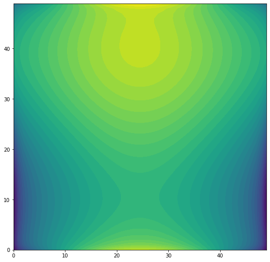

# **Введение**

Одномерные и двумерные задачи математического моделирования являются по-существу модельными ввиду своей природы проецировать все наши процессы, протекающие в трехмерном пространстве, на некую проекцию, в которой легко наблюдать за поставленным экспериментом. Данные задачи нужны для контролируемого вопроизведения модельных постановок реальных процессов, чтобы понять является ли поставленная система уравнений отражением некоторой части действительности и дальнейшего перехода к задачам более высокой размерности. 

Ранее мы решали одномерную задачу интегрального уравнения с вырожденым ядром для оттачивания навыков численного решения интегральных уравнений различными численными методами, среди которых метод кусочно-постоянных аппроксимаций и коллокация, являющийся отражением метода серединных прямоугольников на решение уравнений, а также метод Галеркина.

В данной практической работе речь пойдет о решении двумерных модельных задач, принципах построения системы дискретизации на простой двумерной плоскости, а также задача решения модельного уравнения Фредгольма второго рода на простой двумерной системе дисркетизаций с применением итреационных методов.

# **Постановка задачи**

1. Задать квадратную область $\Sigma$ с помощью параметризации вида:

$$
\Sigma \in \left\{(x_1, x_2) \in \mathbb{R}^2\ |\ x_1 \in \left[x^c_1 - \frac{H}{2}, x^c_1 + \frac{H}{2}\right],\ x_2 \in \left[x_2^c - \frac{H}{2}, x^c_2 + \frac{H}{2}\right]\right\},
$$
где $(x^c_1, x^c_2)\ -$ точка центра квадрата, $H\ -$ ширина рассматриваемой области.

2. С помощью параметра дискретизации $N\ -$ числа ячеек разбиения по одной оси произвести дискретизацию области на систему квадратов $\sigma_i$, таких что (figure 1):

$$
\Sigma = \underset{{i=1}}{\overset{N^2}{\cup}} \sigma_i;\ \  x_c^i = (x_1^i, x_2^i) \in \sigma_i;\ \ i = 1,2,\dots, N^2;\ \  h = H / N,
$$

.png)

с одинаковой мерой $\mu(\sigma_i) = h^2$.

3. Решить интегрального уравнения Фредгольма 2-го рода в двумерном случае с использованием метода коллокаций при $N = 10, 20, 30, 40$ при помощи метода градиентного спуска, двухшагового метода градиентного спуска и метода биспоряженных градиентнов.

**Постановка задачи:**

$$
U(x) + \int_{\Sigma} K(x, y)U(y)dy = f(x), \ \ x,y \in \mathbb{R}^2
$$

- ядро интегрального уравнения:

$$
K(x, y) = \frac{1}{4\cdot \pi \cdot |x - y|} = \frac{1}{4\cdot \pi \cdot \sqrt{(x_1 - y_1)^2 + (x_2 - y_2)^2}}, \ \ x = (x_1, x_2), \ \ y = (y_1, y_2),
$$
- внешняя функция

$$
f(x) = sin(x_1) + cos(x_2)
$$

**Дискретизация уравнения:**

Уравнение в дискретном случае для метода коллокаций можно записать следующим образом:

$$
U(x_i) + \sum_{j = 1, j\ne i}^{N^2}\int_{\sigma_j} K(x_i, y)U(y) dy = f(x_i), \ i = 1, 2, \dots, N^2,
$$

или же переписав в более удобном виде:

$$
U_i + \sum_{j = 1, j\ne i}^{N^2} K(x_i, x_j) \cdot U_j \cdot h^2 = sin(x_1^i) + cos(x_2^i), \ i = 1, 2, \dots, N^2,
$$

Получить задачу решения СЛАУ относительно неизвестного вектора $u$:

$$
Au = f, \quad A = I + K\cdot h^2, \quad K = k_{ij} = \left\{ \begin{matrix}0, & i = j\\ \frac{1}{4 \cdot \pi \cdot |x_i - x_j|}, & i\ne j\end{matrix} \right. ,\quad f = f_i = sin(x_1^i) + cos(x_2^j).
$$

4. Удостовериться в одинаковости результатов решения уравнения различными итерационными методами при разных значениях количества дискретных разбиений поверхности.

5. Для каждого итерационного метода показать количество умножений матрицы на вектор, потребовавшегося для решения задачи при различных $N$. Составить сравнительную таблицу результатов.

6. Визуализировать результат решения задачи на двумерной плоскости в виде тепловой карты (figure 1, figure 2):

